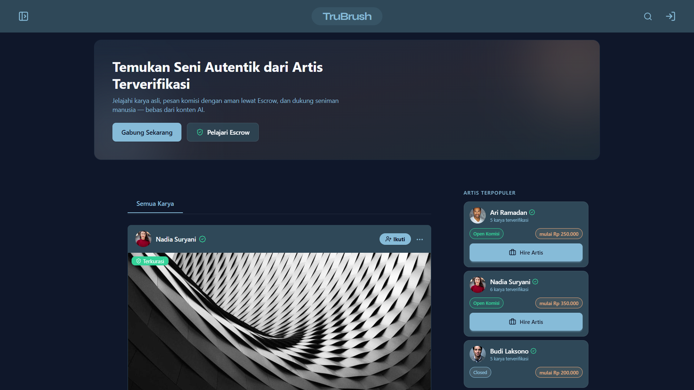
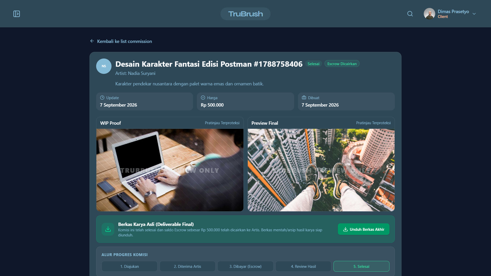
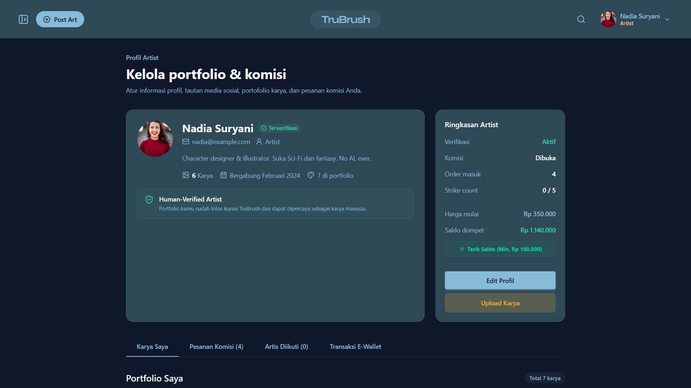
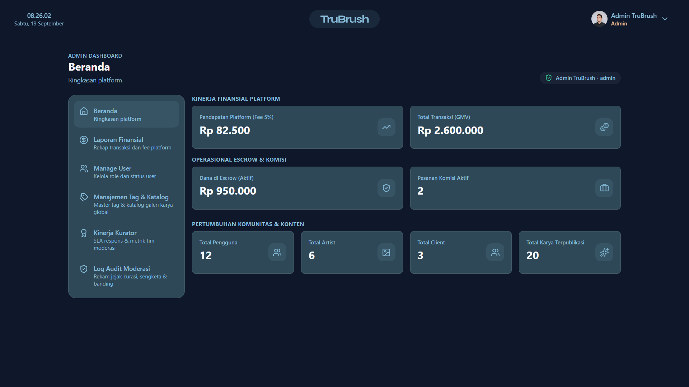

# TruBrush Frontend

Aplikasi web untuk platform portofolio seni digital dan pemesanan komisi berbasis escrow. TruBrush hanya menerima karya buatan manusia: seniman diminta melampirkan bukti proses pengerjaan, dan karya diperiksa kurator sebelum tampil di galeri publik.

Repositori ini berisi sisi frontend, dibangun dengan Next.js (App Router) dan React. Frontend berkomunikasi dengan REST API backend TruBrush.

## Demo

| Layanan             | URL                                                 |
| ------------------- | --------------------------------------------------- |
| Frontend            | https://trubrush.vercel.app                         |
| Backend (API)       | https://trubrush-be.up.railway.app/api              |
| Repositori frontend | https://github.com/Revou-FSSE-Feb26/crack-fe-Diba15 |
| Repositori backend  | https://github.com/Revou-FSSE-Feb26/crack-be-Diba15 |

## Daftar Isi

- [Demo](#demo)
- [Fitur](#fitur)
- [Tech Stack](#tech-stack)
- [Tampilan Aplikasi](#tampilan-aplikasi)
- [Struktur Direktori](#struktur-direktori)
- [Instalasi](#instalasi)
- [Cara Penggunaan](#cara-penggunaan)
- [Skrip yang Tersedia](#skrip-yang-tersedia)
- [Dokumentasi Tambahan](#dokumentasi-tambahan)

## Fitur

### Galeri dan unggah karya

- Unggah karya di `/post-art`, dengan lampiran bukti proses (sketsa, video timelapse, atau layer).
- Feed publik di `/` dengan infinite scroll dan filter berdasarkan tag.
- Proteksi sisi klien untuk mempersulit penyalinan gambar:
  - Kanvas diburamkan saat jendela kehilangan fokus (misalnya saat berpindah tab atau membuka Snipping Tool).
  - Menu klik kanan dinonaktifkan pada gambar.

  Proteksi ini hanya menyulitkan penyalinan biasa dan tidak dapat mencegahnya sepenuhnya.

### Komisi dan escrow

- Klien memesan komisi langsung dari profil seniman yang sudah terverifikasi.
- Pembayaran dilakukan di `/commissions/:id/payment`. Dana ditahan di rekening escrow platform sampai pekerjaan selesai.
- Progres komisi dilacak per milestone: pratinjau sketsa, persetujuan, revisi, dan pengiriman hasil akhir.

### Dompet digital

- Top up saldo di `/topup` untuk membayar komisi.
- Penarikan pendapatan seniman di `/withdraw`, dengan minimum Rp 100.000.

### Dashboard admin dan kurator

| Rute                             | Fungsi                                                                         |
| -------------------------------- | ------------------------------------------------------------------------------ |
| `/dashboard`                     | Ringkasan transaksi aktif dan status akun                                      |
| `/dashboard/review-artworks`     | Antrean verifikasi bukti proses karya                                          |
| `/dashboard/review-reports`      | Penanganan laporan karya yang diduga plagiat atau buatan AI                    |
| `/dashboard/review-disputes`     | Mediasi sengketa dan klaim refund komisi                                       |
| `/dashboard/manage-users`        | Manajemen pengguna, pengubahan role, dan peninjauan banding akun               |
| `/dashboard/manage-tags`         | CRUD tag dan takedown karya                                                    |
| `/dashboard/financial-reports`   | Laporan GMV, saldo escrow, dan fee platform 5%; ekspor CSV dan cetak           |
| `/dashboard/curator-performance` | SLA respons kurator, rasio kelolosan verifikasi, dan Top Moderator; ekspor CSV |
| `/dashboard/audit-logs`          | Riwayat keputusan staf kurator dan admin secara kronologis                     |

## Tech Stack

| Kategori             | Teknologi                                                                                                                                                        |
| -------------------- | ---------------------------------------------------------------------------------------------------------------------------------------------------------------- |
| Bahasa               | [TypeScript](https://www.typescriptlang.org/) (5.9.3)                                                                                                            |
| Framework            | [Next.js 16](https://nextjs.org/) (App Router, Turbopack, Server Actions)                                                                                        |
| UI dan state         | [React 19](https://react.dev/), [Zustand](https://zustand-demo.pmnd.rs/) (state klien), [TanStack Query v5](https://tanstack.com/query) (server state dan cache) |
| Styling              | [Tailwind CSS v4](https://tailwindcss.com/), [DaisyUI v5](https://daisyui.com/), [Lucide React](https://lucide.dev/)                                             |
| HTTP dan validasi    | [Axios](https://axios-http.com/), [Zod](https://zod.dev/)                                                                                                        |
| Linter dan formatter | [Biome](https://biomejs.dev/)                                                                                                                                    |
| Package manager      | [Bun](https://bun.sh/)                                                                                                                                           |

## Tampilan Aplikasi

### Home



### Commission



### Profile



### Dashboard



## Struktur Direktori

```
crack-fe-Diba15/
├── docs/                   # Dokumentasi arsitektur dan proses bisnis
│   ├── screenshots/        # Gambar untuk bagian Tampilan Aplikasi
│   ├── ARCHITECTURE_CHECKLIST.md
│   ├── BUSINESS_PROCESS.md
│   ├── ERD.md
│   ├── LOGIC_DOCS.md
│   ├── REPORT_YAGNI.md
│   ├── TEST_SCENARIO.md
│   └── TODO.md
├── src/
│   ├── app/                # Halaman App Router dan route handler BFF
│   │   ├── (auth)/         # Login, signup, lupa dan reset password
│   │   ├── api/            # Route handler BFF (/api/auth, /api/artwork, dll.)
│   │   ├── commissions/    # Detail komisi dan pembayaran
│   │   ├── dashboard/      # Halaman admin dan kurator
│   │   ├── profile/        # Profil seniman/klien dan banding
│   │   └── layout.tsx      # Layout global dan provider
│   ├── components/
│   │   ├── dashboard/      # Komponen khusus dashboard
│   │   ├── ui/             # Komponen generik (DataTable, Stat, Modal)
│   │   └── ...
│   ├── hooks/              # Custom hook (TanStack Query dan utilitas)
│   ├── lib/                # Konfigurasi Axios dan query key
│   ├── store/              # Store Zustand (UserStore, ToastStore, ModalStore)
│   ├── types/              # Tipe dan interface bersama
│   └── utils/              # Formatter harga, tanggal, mata uang; validasi file
├── biome.json
├── package.json
└── tsconfig.json
```

## Instalasi

### Prasyarat

- [Bun](https://bun.sh/). Cek dengan `bun --version`.
- Backend TruBrush, dari [repositori backend](https://github.com/Revou-FSSE-Feb26/crack-be-Diba15). Alternatifnya, arahkan `NEXT_PUBLIC_API_URL` ke backend yang sudah dideploy (lihat bagian [Demo](#demo)).

### Langkah

1. Pasang dependensi:

   ```bash
   bun install
   ```

2. Buat berkas `.env.local` di root proyek:

   ```env
   NEXT_PUBLIC_API_URL=http://localhost:3001/api
   ```

3. Jalankan server development:

   ```bash
   bun run dev
   ```

   Aplikasi dapat diakses di <http://localhost:3000>.

## Cara Penggunaan

Akun demo untuk mencoba tiap role:

| Role    | Email               | Password   |
| ------- | ------------------- | ---------- |
| Client  | dimas@example.com   | client123  |
| Artist  | nadia@example.com   | artist123  |
| Curator | hendra@trubrush.com | curator123 |

Alur yang bisa dicoba:

1. Masuk sebagai artist, lalu unggah karya di `/post-art` beserta bukti proses.
2. Masuk sebagai curator, lalu setujui karya di `/dashboard/review-artworks`.
3. Masuk sebagai client, pesan komisi dari profil artist, lalu bayar lewat halaman pembayaran.
4. Kembali sebagai artist untuk mengirim progres, lalu tarik dana di `/withdraw`.

## Skrip yang Tersedia

| Perintah        | Fungsi                                              |
| --------------- | --------------------------------------------------- |
| `bun run dev`   | Menjalankan server development                      |
| `bun run build` | Membuat build produksi                              |
| `bun run check` | Menjalankan lint dan pengecekan format dengan Biome |

Sebelum membuka pull request, pastikan `bun run check` dan `bun run build` selesai tanpa error.

## Dokumentasi Tambahan

- [Proses bisnis](docs/BUSINESS_PROCESS.md)
- [Logika bisnis dan rumus perhitungan](docs/LOGIC_DOCS.md)
- [Laporan audit YAGNI](docs/REPORT_YAGNI.md)
- [Skenario pengujian manual](docs/TEST_SCENARIO.md)
- [Log progres pengembangan](docs/TODO.md)
- [ERD](docs/ERD.md)
