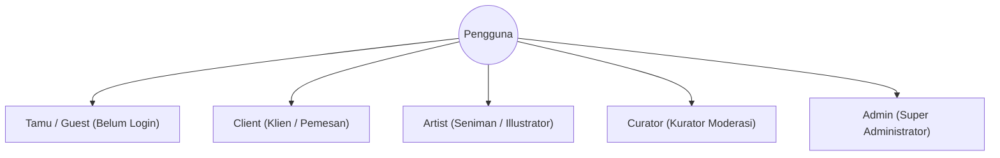
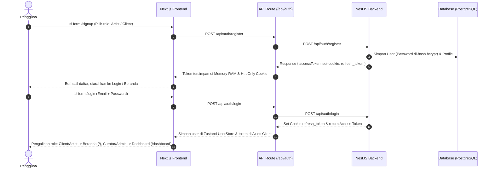
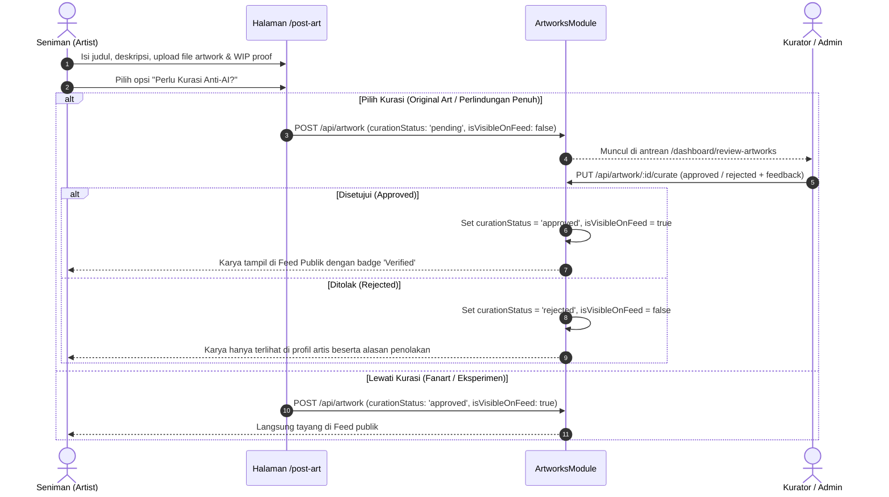
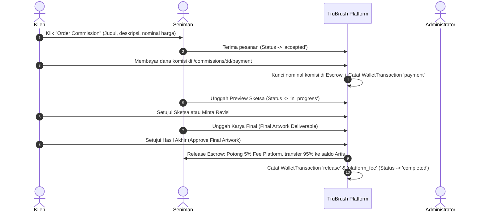

# 📖 Dokumentasi Lengkap Aplikasi & Proses Bisnis End-to-End TruBrush

Dokumen ini merangkum secara komprehensif **arsitektur sistem, hak akses pengguna (RBAC), spesifikasi modul, alur bisnis *end-to-end* (E2E), dan struktur basis data** pada platform **TruBrush**.

---

## 📑 Daftar Isi
1. [Ringkasan Platform & Nilai Bisnis](#1-ringkasan-platform--nilai-bisnis)
2. [Aktor Sistem & Matriks Hak Akses (RBAC)](#2-aktor-sistem--matriks-hak-akses-rbac)
3. [Alur Proses Bisnis End-to-End (E2E Workflows)](#3-alur-proses-bisnis-end-to-end-e2e-workflows)
   - [3.1 Alur Registrasi, Otentikasi & Pengalihan Sesi](#31-alur-registrasi-otentikasi--pengalihan-sesi)
   - [3.2 Alur Unggah Karya Seni & Kurasi Anti-AI](#32-alur-unggah-karya-seni--kurasi-anti-ai)
   - [3.3 Alur Pesanan Komisi & Perlindungan Dana Escrow](#33-alur-pesanan-komisi--perlindungan-dana-escrow)
   - [3.4 Alur Dompet: Top Up Saldo & Penarikan Dana Artis (*Withdraw*)](#34-alur-dompet-top-up-saldo--penarikan-dana-artis-withdraw)
   - [3.5 Alur Pelaporan Karya, Penalti Strike & Banding Akun (*Appeals*)](#35-alur-pelaporan-karya-penalti-strike--banding-akun-appeals)
   - [3.6 Alur Mediasi Sengketa Komisi (*Disputes*) & Pengembalian Dana](#36-alur-mediasi-sengketa-komisi-disputes--pengembalian-dana)
   - [3.7 Alur Manajemen Tag Master & Takedown Katalog Global](#37-alur-manajemen-tag-master--takedown-katalog-global)
   - [3.8 Alur Laporan Finansial & Audit Transaksi Platform](#38-alur-laporan-finansial--audit-transaksi-platform)
   - [3.9 Alur Laporan Kinerja Moderasi & Metrik SLA Kurator](#39-alur-laporan-kinerja-moderasi--metrik-sla-kurator)
   - [3.10 Alur Rekam Jejak Audit Log Kronologis](#310-alur-rekam-jejak-audit-log-kronologis)
4. [Mekanisme Keamanan Hak Cipta & Anti-Scraping AI](#4-mekanisme-keamanan-hak-cipta--anti-scraping-ai)
5. [Struktur Model Data Database (ERD Prisma)](#5-struktur-model-data-database-erd-prisma)

---

## 🌐 1. Ringkasan Platform & Nilai Bisnis

**TruBrush** lahir sebagai solusi ekosistem seni digital yang aman, otentik, dan transparan bagi seniman manusia dan kolektor/klien di tengah maraknya konten generatif AI (*Generative AI*).

### Nilai Utama Platform:
1. **Perlindungan Hak Cipta Seniman Manusia:** Menjamin bahwa karya yang berlabel terverifikasi (*verified*) di feed publik dibuat secara otentik oleh manusia melalui bukti alur kerja (*Proof of Work / Work In Progress*).
2. **Kurasi Independen & Transparan:** Komunitas kurator meninjau bukti sketsa, rekaman video proses, dan layer pengerjaan sebelum karya lolos verifikasi.
3. **Pasar Komisi Aman Berbasis Escrow:** Klien membayar di muka ke rekening *escrow* platform (dengan potongan fee platform 5%), dan dana baru dicairkan ke seniman setelah karya final disetujui tanpa risiko penipuan dari kedua belah pihak.
4. **Anti-Scraping & Copy Defense:** Fitur keamanan browser canggih yang menghalangi scraping bot AI, screenshot liar, dan pengunduhan deliverable tanpa izin.
5. **Akuntabilitas Moderasi & Audit Finansial:** Rekam jejak seluruh mutasi dana kas platform, penindakan sanksi/strike, dan SLA kecepatan moderasi tercatat transparan.

---

## 👥 2. Aktor Sistem & Matriks Hak Akses (RBAC)

Platform TruBrush memiliki 4 peran pengguna (*Roles*) terdaftar dan 1 status pengunjung umum (*Guest*):



### Matriks Hak Akses Fitur:

| Fitur / Modul | Tamu (Guest) | Client | Artist | Curator | Admin |
| :--- | :---: | :---: | :---: | :---: | :---: |
| Jelajah Feed & Portofolio Artis | ✅ | ✅ | ✅ | ✅ | ✅ |
| Pencarian Karya, Tag & Artis | ✅ | ✅ | ✅ | ✅ | ✅ |
| Like / Favorite Karya & Follow Artis | ❌ (Redirect Login) | ✅ | ✅ | ✅ | ✅ |
| Unggah Karya & Bukti WIP (`/post-art`) | ❌ | ❌ | ✅ | ❌ | ❌ |
| Memesan Komisi Seni (`Order Modal`) | ❌ (Redirect Login) | ✅ | ❌ | ❌ | ❌ |
| Bayar Komisi ke Escrow (`/payment`) | ❌ | ✅ | ❌ | ❌ | ❌ |
| Unggah Deliverables & Kirim Revisi | ❌ | ❌ | ✅ | ❌ | ❌ |
| Setujui Hasil Akhir & Release Escrow | ❌ | ✅ | ❌ | ❌ | ❌ |
| Ajukan Sengketa Komisi (*File Dispute*) | ❌ | ✅ | ❌ | ❌ | ❌ |
| Top Up Saldo Dompet (`/topup`) | ❌ | ✅ | ✅ | ❌ | ❌ |
| Penarikan Dana Artis (`/withdraw`) | ❌ | ❌ | ✅ | ❌ | ❌ |
| Ajukan Banding Akun (`ArtistAppealBox`) | ❌ | ❌ | ✅ (Jika Terkena Sanksi) | ❌ | ❌ |
| Lapor Karya Bermasalah (`Report Modal`)| ❌ (Redirect Login) | ✅ | ✅ | ✅ | ✅ |
| Review & Kurasi Karya Anti-AI (`/dashboard/review-artworks`)| ❌ | ❌ | ❌ | ✅ | ✅ |
| Review Laporan Pengguna (`/dashboard/review-reports`)| ❌ | ❌ | ❌ | ✅ | ✅ |
| Resolusi Sengketa Komisi (`/dashboard/review-disputes`)| ❌ | ❌ | ❌ | ❌ | ✅ |
| Kelola Akun & Permohonan Banding (`/dashboard/manage-users`)| ❌ | ❌ | ❌ | ❌ | ✅ |
| Kelola Master Tag & Takedown Katalog (`/dashboard/manage-tags`)| ❌ | ❌ | ❌ | ❌ | ✅ |
| Audit Finansial & Buku Kas (`/dashboard/financial-reports`)| ❌ | ❌ | ❌ | ❌ | ✅ |
| Evaluasi Kinerja & Metrik SLA Kurator (`/dashboard/curator-performance`)| ❌ | ❌ | ❌ | ❌ | ✅ |
| Rekam Jejak Log Audit Kronologis (`/dashboard/audit-logs`)| ❌ | ❌ | ❌ | ❌ | ✅ |

---

## 🔄 3. Alur Proses Bisnis End-to-End (E2E Workflows)

### 3.1 Alur Registrasi, Otentikasi & Pengalihan Sesi



---

### 3.2 Alur Unggah Karya Seni & Kurasi Anti-AI



---

### 3.3 Alur Pesanan Komisi & Perlindungan Dana Escrow



---

### 3.4 Alur Dompet: Top Up Saldo & Penarikan Dana Artis (*Withdraw*)

1. **Top Up Saldo Klien & Artis (`/topup`):**
   - Pengguna memilih nominal top up (misal Rp 100.000, Rp 500.000, dll.).
   - Saldo pengguna bertambah secara instan.
   - Tercatat transaksi dompet tipe `topup` di riwayat transaksi.
2. **Penarikan Dana Artis (`/withdraw`):**
   - Seniman dapat mencairkan saldo hasil pengerjaan komisi ke rekening bank atau e-wallet.
   - Minimal pencairan adalah **Rp 100.000**.
   - Saldo dompet seniman berkurang dan tercatat transaksi dompet tipe `withdraw`.

---

### 3.5 Alur Pelaporan Karya, Penalti Strike & Banding Akun (*Appeals*)

1. **Pengajuan Laporan:**
   - Pengguna melaporkan karya yang terindikasi melanggar hak cipta / konten AI ilegal.
2. **Peninjauan Kurator (`/dashboard/review-reports`):**
   - Kurator meninjau karya dan laporan.
   - Jika laporan disetujui (*Approved*):
     - Karya disembunyikan dari feed publik (`isVisibleOnFeed: false`).
     - Seniman pemilik karya menerima tambahan **+1 Strike Point**.
3. **Akun Terkena Sanksi (Banned/Penalti):**
   - Jika `strikeCount >= 3`, akun seniman dibekukan dari aktivitas publik.
4. **Pengajuan Banding Seniman (`ArtistAppealBox` di `/profile`):**
   - Seniman dapat mengisi formulir pengajuan banding akun dengan melampirkan alasan dan bukti orisinalitas tambahan.
5. **Resolusi Banding oleh Admin (`/dashboard/manage-users`):**
   - Admin memeriksa permohonan banding pada modal `ReviewAppealModal`.
   - Jika diterima (*Approved*): Status akun dipulihkan dan jumlah strike di-reset menjadi 0.
   - Jika ditolak (*Rejected*): Sanksi akun tetap dipertahankan.

---

### 3.6 Alur Mediasi Sengketa Komisi (*Disputes*) & Pengembalian Dana

1. **Pengajuan Sengketa oleh Klien:**
   - Jika seniman tidak merespons atau melanggar kesepakatan komisi aktif, klien dapat mengajukan *Dispute*.
2. **Mediasi oleh Admin (`/dashboard/review-disputes`):**
   - Admin memeriksa kronologi percakapan, revisi, dan deliverable.
   - **Keputusan Refund Penuh:** 100% dana escrow dikembalikan ke saldo klien, status pesanan dibatalkan (`cancelled`), dan seniman menerima penalti +1 strike.
   - **Keputusan Lanjutkan Komisi:** Komisi dikembalikan ke status aktif pengerjaan.

---

### 3.7 Alur Manajemen Tag Master & Takedown Katalog Global

1. **Kelola Tag Master (`/dashboard/manage-tags`):**
   - Admin dapat membuat tag baru (`POST /api/artworks/tags`), mengubah nama tag (`PATCH /api/artworks/tags/:id`), dan menghapus tag (`DELETE /api/artworks/tags/:id`).
   - Penghapusan tag aman karena database menggunakan transaksi relasional yang melepaskan relasi tag tanpa menghapus karya seni terkait.
2. **Moderasi Takedown & Restore Katalog Global:**
   - Admin dapat melakukan *Takedown* pada karya apapun yang melanggar agar disembunyikan dari feed publik (`isVisibleOnFeed: false`).
   - Admin dapat memulihkan (*Restore*) kembali karya tersebut sewaktu-waktu.

---

### 3.8 Alur Laporan Finansial & Audit Transaksi Platform

1. **Monitoring Finansial Eksekutif (`/dashboard/financial-reports`):**
   - **Total Transaksi GMV:** Total perputaran dana komisi di platform.
   - **Dana Tertahan di Escrow:** Saldo pesanan komisi aktif yang diamankan platform.
   - **Pendapatan Fee Platform (5%):** Pendapatan bersih platform dari setiap komisi yang sukses diselesaikan.
   - **Total Pencairan Artis:** Total dana yang berhasil ditarik (*withdraw*) oleh seniman.
2. **Audit Buku Kas & Ekspor Data:**
   - Seluruh mutasi `WalletTransaction` dapat difilter berdasarkan tipe transaksi, pencarian ID/nama, dan rentang tanggal (*Date Presets & Custom Picker*).
   - Mendukung cetak langsung (*Print Report*) dan unduh berkas CSV (*Export CSV*).

---

### 3.9 Alur Laporan Kinerja Moderasi & Metrik SLA Kurator

1. **Monitoring Kinerja Tim Kurasi (`/dashboard/curator-performance`):**
   - **Rata-rata SLA Respons:** Waktu rata-rata kurator menyelesaikan kurasi sejak karya diunggah (`reviewedAt - createdAt`).
   - **Total Karya Selesai Dikurasi:** Jumlah karya yang telah diverifikasi (lolos / tolak).
   - **Rasio Kelolosan Anti-AI:** Persentase kelolosan karya asli manusia.
   - **Total Mediasi & Aduan:** Agregasi penyelesaian sengketa komisi dan laporan pengguna.
2. **Top Performer Spotlight:** Menampilkan kartu penghargaan kurator dengan kontribusi dan kecepatan SLA terbaik.
3. **Ekspor Laporan Kinerja CSV:** Memungkinkan pengunduhan rekap metrik tim kurasi untuk evaluasi manajerial.

---

### 3.10 Alur Rekam Jejak Audit Log Kronologis

1. **Transparansi Log Audit (`/dashboard/audit-logs`):**
   - Merekam secara kronologis setiap keputusan yang diambil oleh staf moderator/admin:
     - Kurasi karya seni (*Approved / Rejected*).
     - Tindakan laporan aduan pengguna (*Approved / Dismissed*).
     - Resolusi sengketa komisi (*Refund / Reject Dispute*).
     - Resolusi permohonan banding seniman (*Approved / Rejected Appeal*).
2. **Filter & Akuntabilitas:**
   - Dapat difilter berdasarkan kategori aksi, nama staf moderator, ID subjek, dan rentang waktu.

---

## 🛡️ 4. Mekanisme Keamanan Hak Cipta & Anti-Scraping AI

| Mekanisme Keamanan | Implementasi Teknis | Tujuan Perlindungan |
| :--- | :--- | :--- |
| **Window Blur Defense** | `useCopyProtection.ts` | Mengaktifkan tirai blur saat pengguna berpindah tab atau membuka tools screenshot (Snipping Tool). |
| **DevTools & Shortcut Blocker** | `useCopyProtection.ts` | Memblokir tombol `F12`, `Ctrl+Shift+I`, `Ctrl+Shift+J`, dan `Ctrl+U`. |
| **Context Menu & Drag Shield** | `onContextMenu={(e) => e.preventDefault()}` | Mencegah klik kanan untuk menyimpan gambar (`Save Image As...`) dan dragging berkas. |
| **Media Stream Protection** | `controlsList="nodownload"` | Mencegah tombol download bawaan browser pada video timelapse WIP. |
| **RAM-Only Access Token** | `axiosClient.ts` (in-memory variable) | Mencegah pencurian token JWT melalui serangan XSS (tidak disimpan di localStorage). |
| **HttpOnly Refresh Cookie** | `axiosServer.ts` (`httpOnly: true, sameSite: lax`) | Mencegah akses script jahat ke cookie otentikasi jangka panjang. |

---

## 🗄️ 5. Struktur Model Data Database (ERD Prisma)

```
┌──────────────┐       1:1       ┌────────────────┐
│     User     ├─────────────────┤    Profile     │
│ (Auth & Role)│                 │ (Bio & Strikes)│
└──────┬───────┘                 └───────┬────────┘
       │                                 │
       ├─────────────────┐               │ 1:N
       │ 1:N             │ 1:N           ▼
┌──────▼───────┐   ┌─────▼──────┐  ┌──────────────┐
│   Artwork    │   │ Commission │  │    Appeal    │
│ (WIP & Art)  │   │  (Escrow)  │  │(Account Ban) │
└──────┬───────┘   └─────┬──────┘  └──────────────┘
       │                 │
       ├──────────┐      ├────────────────────────┐
       │ 1:N      │ 1:N  │ 1:N                    │ 1:N
┌──────▼───────┐┌─▼──────▼─────┐           ┌──────▼───────┐
│  ArtworkTag  ││Dispute / Log │           │  WalletTx    │
└──────┬───────┘└──────────────┘           │ (Cash Ledger)│
       │ N:1                               └──────────────┘
┌──────▼───────┐
│     Tag      │
│  (Catalog)   │
└──────────────┘
```

---

## 🚀 Kesimpulan & Pedoman Perawatan

Aplikasi TruBrush telah mengimplementasikan seluruh proses bisnis di atas dengan standar kualitas tinggi, kepatuhan arsitektur **SOLID, DRY, dan KISS**, pengujian unit test 100% lulus, serta rancangan antarmuka modular yang siap dikembangkan lebih lanjut.
