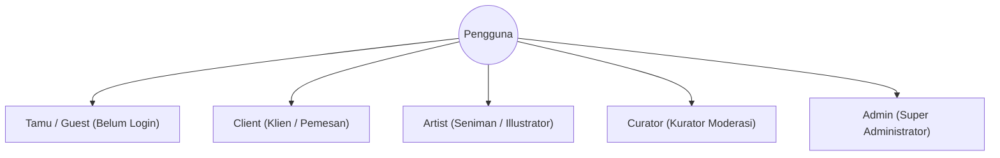
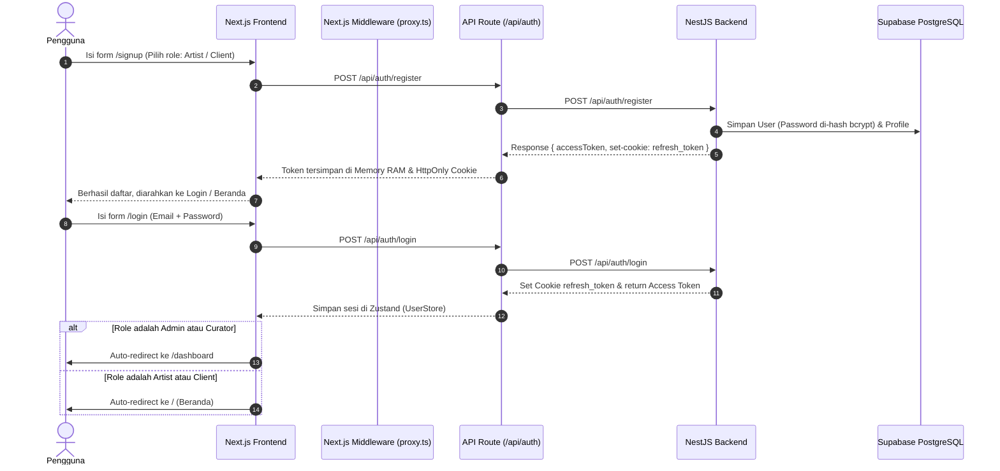
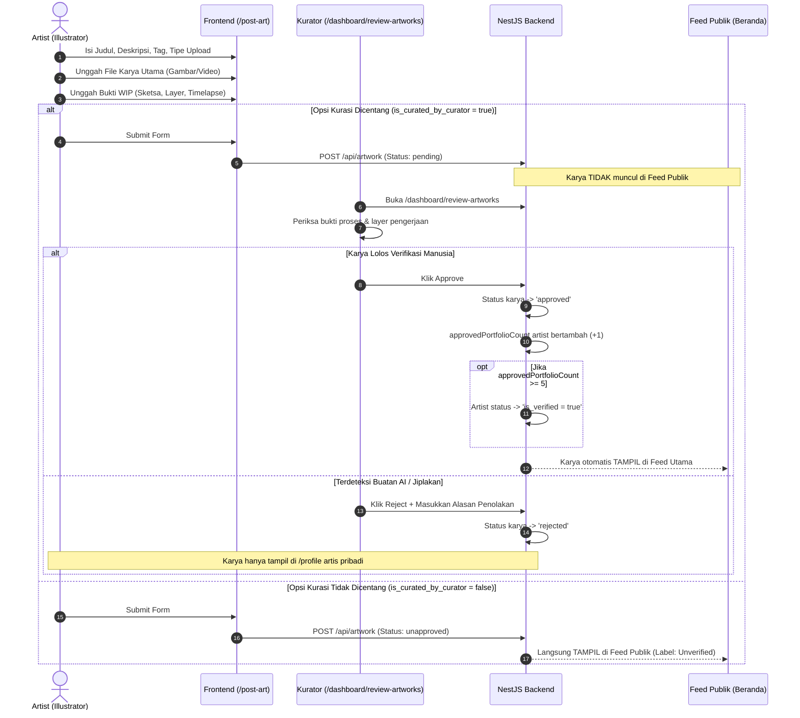
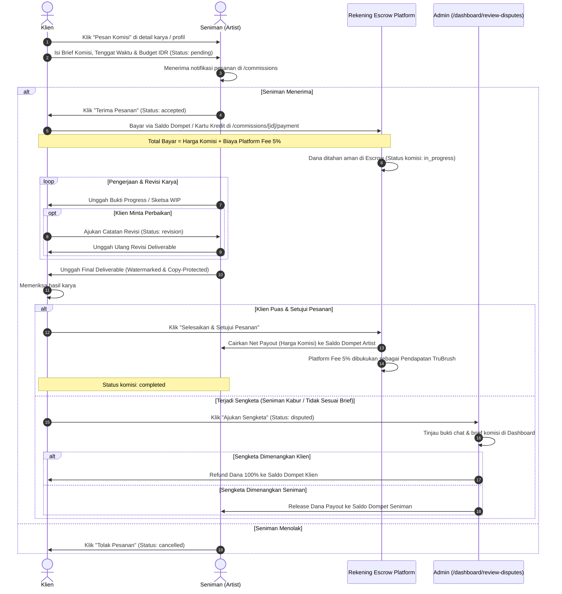
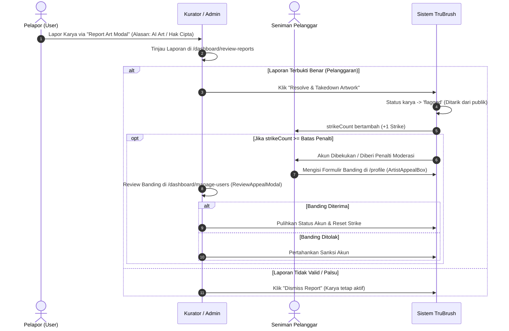

# 📖 Dokumentasi Lengkap Aplikasi & Proses Bisnis End-to-End TruBrush

Dokumen ini merangkum secara komprehensif **arsitektur sistem, hak akses pengguna, spesifikasi modul, dan seluruh proses bisnis *end-to-end* (E2E)** pada platform **TruBrush**.

---

## 📑 Daftar Isi
1. [Ringkasan Platform & Nilai Bisnis](#1-ringkasan-platform--nilai-bisnis)
2. [Aktor Sistem & Matriks Hak Akses (RBAC)](#2-aktor-sistem--matriks-hak-akses-rbac)
3. [Alur Proses Bisnis End-to-End (E2E Workflows)](#3-alur-proses-bisnis-end-to-end-e2e-workflows)
   - [3.1 Alur Registrasi, Otentikasi & Pengalihan Sesi](#31-alur-registrasi-otentikasi--pengalihan-sesi)
   - [3.2 Alur Unggah Karya Seni & Kurasi Anti-AI](#32-alur-unggah-karya-seni--kurasi-anti-ai)
   - [3.3 Alur Pesanan Komisi & Perlindungan Dana Escrow](#33-alur-pesanan-komisi--perlindungan-dana-escrow)
   - [3.4 Alur Dompet: Top Up Saldo & Penarikan Dana Artis (*Withdraw*)](#34-alur-dompet-top-up-saldo--penarikan-dana-artis-withdraw)
   - [3.5 Alur Pelaporan Karya, Penalti Strike & Banding Akun](#35-alur-pelaporan-karya-penalti-strike--banding-akun)
   - [3.6 Alur Interaksi Sosial & Pencarian Multi-Entitas](#36-alur-interaksi-sosial--pencarian-multi-entitas)
   - [3.7 Alur Dashboard Eksekutif & Manajemen Pengguna Admin](#37-alur-dashboard-eksekutif--manajemen-pengguna-admin)
4. [Mekanisme Keamanan Hak Cipta & Anti-Scraping AI](#4-mekanisme-keamanan-hak-cipta--anti-scraping-ai)
5. [Struktur Model Data Database (ERD Prisma)](#5-struktur-model-data-database-erd-prisma)

---

## 🌐 1. Ringkasan Platform & Nilai Bisnis

**TruBrush** lahir sebagai solusi ekosistem seni digital yang aman dan transparan di tengah maraknya konten buatan kecerdasan buatan (*generative AI*). 

### Nilai Utama Platform:
1. **Perlindungan Hak Cipta Seniman Manusia:** Menjamin bahwa seluruh karya yang berlabel terverifikasi di feed publik dibuat secara otentik oleh manusia melalui bukti alur kerja (*Proof of Work / Work In Progress*).
2. **Kurasi Independen & Transparan:** Komunitas kurator meninjau bukti sketsa, rekaman video proses, dan layer pengerjaan sebelum karya lolos verifikasi.
3. **Pasar Komisi Aman Berbasis Escrow:** Klien membayar di muka ke rekening *escrow* platform (dengan biaya admin 5%), dan dana baru dicairkan ke seniman setelah karya final disetujui tanpa risiko penipuan dari kedua belah pihak.
4. **Anti-Scraping & Copy Defense:** Fitur keamanan browser canggih yang menghalangi scraping bot AI, screenshot liar, dan pengunduhan deliverable tanpa izin.

---

## 👥 2. Aktor Sistem & Matriks Hak Akses (RBAC)

Platform TruBrush memiliki 4 peran pengguna (*Roles*) ditambah 1 status pengunjung umum:



### Matriks Hak Akses Fitur:

| Fitur / Modul | Tamu (Guest) | Client | Artist | Curator | Admin |
| :--- | :---: | :---: | :---: | :---: | :---: |
| Jelajah Feed & Portofolio Artis | ✅ | ✅ | ✅ | ✅ | ✅ |
| Pencarian Karya, Tag & Artis | ✅ | ✅ | ✅ | ✅ | ✅ |
| Like / Favorite Karya & Follow Artis | ❌ (Redirect Login) | ✅ | ✅ | ✅ | ✅ |
| Unggah Karya & Bukti WIP (`/post-art`) | ❌ | ❌ | ✅ | ❌ | ❌ |
| Memesan Komisi Seni (`Order Modal`) | ❌ (Redirect Login) | ✅ | ❌ | ❌ | ❌ |
| Bayar Komisi ke Escrow (`/payment`) | ❌ | ✅ | ❌ | ❌ | ❌ |
| Unggah Deliverables & Kirim Revisi | ❌ | ❌ | ✅ | ❌ | ❌ |
| Setujui Hasil Akhir & Release Escrow | ❌ | ✅ | ❌ | ❌ | ❌ |
| Ajukan Sengketa Komisi (*File Dispute*) | ❌ | ✅ | ❌ | ❌ | ❌ |
| Top Up Saldo Dompet (`/topup`) | ❌ | ✅ | ✅ | ❌ | ❌ |
| Penarikan Dana Artis (`/withdraw`) | ❌ | ❌ | ✅ | ❌ | ❌ |
| Ajukan Banding Akun (`ArtistAppealBox`) | ❌ | ❌ | ✅ (Jika Strike) | ❌ | ❌ |
| Lapor Karya Bermasalah (`Report Modal`)| ❌ (Redirect Login) | ✅ | ✅ | ✅ | ✅ |
| Review & Kurasi Karya Anti-AI | ❌ | ❌ | ❌ | ✅ | ✅ |
| Review Laporan Pengguna | ❌ | ❌ | ❌ | ✅ | ✅ |
| Resolusi Sengketa Komisi (*Dispute*) | ❌ | ❌ | ❌ | ❌ | ✅ |
| Resolusi Banding Artis (*Appeals*) | ❌ | ❌ | ❌ | ❌ | ✅ |
| Kelola Akun & Tambah Kurator Baru | ❌ | ❌ | ❌ | ❌ | ✅ |
| Monitoring Finansial & Fee 5% Platform | ❌ | ❌ | ❌ | ❌ | ✅ |

---

## 🔄 3. Alur Proses Bisnis End-to-End (E2E Workflows)

### 3.1 Alur Registrasi, Otentikasi & Pengalihan Sesi



---

### 3.2 Alur Unggah Karya Seni & Kurasi Anti-AI



---

### 3.3 Alur Pesanan Komisi & Perlindungan Dana Escrow



---

### 3.4 Alur Dompet: Top Up Saldo & Penarikan Dana Artis (*Withdraw*)

```mermaid
flowchart TD
    subgraph TopUp ["Top Up Saldo (Klien & Seniman)"]
        A1[Masuk ke /topup] --> A2[Pilih Nominal Preset / Input Custom]
        A2 --> A3[Pilih Metode: Virtual Account / Kartu Kredit]
        A3 --> A4[Konfirmasi Pembayaran]
        A4 --> A5[(Saldo User Bertambah)]
        A5 --> A6[Catat Mutasi di Riwayat Dompet]
    end

    subgraph Withdraw ["Penarikan Dana (Khusus Seniman)"]
        B1[Masuk ke /withdraw] --> B2[Validasi: Saldo Tersedia >= Rp 100.000]
        B2 -->|Tidak Cukup| B3[Tampilkan Error & Disable Tombol]
        B2 -->|Cukup| B4[Input Nominal Cair + Pilih Rekening Bank/E-Wallet]
        B4 --> B5[Kalkulasi Biaya Transfer Standar]
        B5 --> B6[Konfirmasi Pencairan Dana]
        B6 --> B7[(Saldo User Berkurang)]
        B7 --> B8[Dana Ditransfer ke Rekening Seniman & Catat Log Transaksi]
    end
```



---

### 3.5 Alur Pelaporan Karya, Penalti Strike & Banding Akun



---

### 3.6 Alur Interaksi Sosial & Pencarian Multi-Entitas

1. **Follow Seniman:**
   - User mengklik tombol *Follow* di kartu karya atau header profil seniman.
   - Status tersinkronisasi instan via `useFollowArtist` (jika belum login, muncul modal login).
2. **Favorit Karya:**
   - User mengklik ikon hati (*Like/Favorite*) di kartu atau halaman detail karya.
   - Karya otomatis masuk ke galeri pribadi di halaman `/favorite`.
3. **Pencarian Cepat (*ModalSearch* & `/search/[param]`):**
   - Mendukung pencarian instan dengan *debouncing* 500ms.
   - Mendukung filter cerdas berdasarkan prefix:
     - `tags:"cyberpunk"` $\rightarrow$ Mencari seluruh karya dengan tag *cyberpunk*.
     - `artists:"diba"` $\rightarrow$ Mencari seluruh karya yang dibuat oleh artist *diba*.
     - Teks biasa $\rightarrow$ Mencari berdasarkan judul karya.

---

### 3.7 Alur Dashboard Eksekutif & Manajemen Pengguna Admin

1. **Ringkasan Finansial Eksekutif:**
   - Menghitung otomatis **Total Transaksi GMV** dari seluruh komisi yang berstatus `paid`, `in_progress`, dan `completed`.
   - Menghitung **Pendapatan Bersih Platform (5% Platform Fee)**.
   - Memonitor **Dana Tertahan di Escrow** (komisi aktif yang belum selesai).
   - Memonitor **Pesanan Komisi Aktif**.
2. **Manajemen Pengguna & Kurator (`/dashboard/manage-users`):**
   - Admin dapat menambahkan akun kurator baru (*Create Curator Modal*).
   - Admin dapat menyunting role, memperbarui data pengguna, serta menghapus (*delete*) akun yang melanggar ketentuan.

---

## 🛡️ 4. Mekanisme Keamanan Hak Cipta & Anti-Scraping AI

TruBrush menerapkan arsitektur keamanan bertingkat (*Defense in Depth*) pada sisi browser dan server:

| Mekanisme Keamanan | Implementasi Teknis | Tujuan Perlindungan |
| :--- | :--- | :--- |
| **Window Blur Defense** | `useCopyProtection.ts` | Mengaktifkan tirai blur saat pengguna berpindah tab atau membuka tools screenshot (Snipping Tool). |
| **DevTools & Shortcut Blocker** | `useCopyProtection.ts` | Memblokir tombol `F12`, `Ctrl+Shift+I`, `Ctrl+Shift+J`, dan `Ctrl+U`. |
| **Context Menu & Drag Shield** | `onContextMenu={(e) => e.preventDefault()}` | Mencegah klik kanan untuk menyimpan gambar (`Save Image As...`) dan dragging berkas. |
| **Media Stream Protection** | `controlsList="nodownload"` | Mencegah tombol download bawaan browser pada video timelapse WIP. |
| **RAM-Only Access Token** | `axiosClient.ts` (in-memory variable) | Mencegah pencurian token JWT melalui serangan XSS (tidak disimpan di localStorage). |
| **HttpOnly Refresh Cookie** | `axiosServer.ts` (`httpOnly: true, sameSite: lax`) | Mencegah akses script jahat ke cookie otentikasi jangka panjang. |

---

## 🗄️ 5. Struktur Model Data Database (ERD Prisma)

```
┌──────────────┐       1:1       ┌────────────────┐
│     User     ├─────────────────┤    Profile     │
│ (Auth & Role)│                 │ (Bio & Strikes)│
└──────┬───────┘                 └────────────────┘
       │ 1:N
       ├──────────────────────────────────────────┐
       │ 1:N                                      │ 1:N
┌──────▼───────┐ 1:N     N:1 ┌──────────────┐     │ 1:N (Client/Artist)
│   Artwork    ├─────────────┤  ArtworkTag  │     │
│ (WIP & Art)  │             └──────┬───────┘ ┌───▼────────────┐
└──────┬───────┘                    │ N:1     │   Commission   │
       │ 1:N                        │         │ (Milestone/Pay)│
       ├──────────────┐      ┌──────▼───────┐ └───┬────────────┘
┌──────▼───────┐┌─────▼─────┐│     Tag      │     │ 1:N
│    Report    ││  Favorite ││  (Catalog)   │ ┌───▼────────────┐
│ (Moderation) ││  (Social) │└──────────────┘ │Comm. Revision  │
└──────────────┘└───────────┘                 └────────────────┘
```

---

## 🚀 Kesimpulan & Pedoman Perawatan

Aplikasi TruBrush telah dirancang dengan kepatuhan penuh terhadap prinsip **SOLID, DRY, dan KISS**, arsitektur berbasis kontrak tipe data yang aman (*Type Safety*), serta pemisahan tanggung jawab yang jelas antara layer presentasi, proxy BFF Next.js, dan core engine NestJS.
