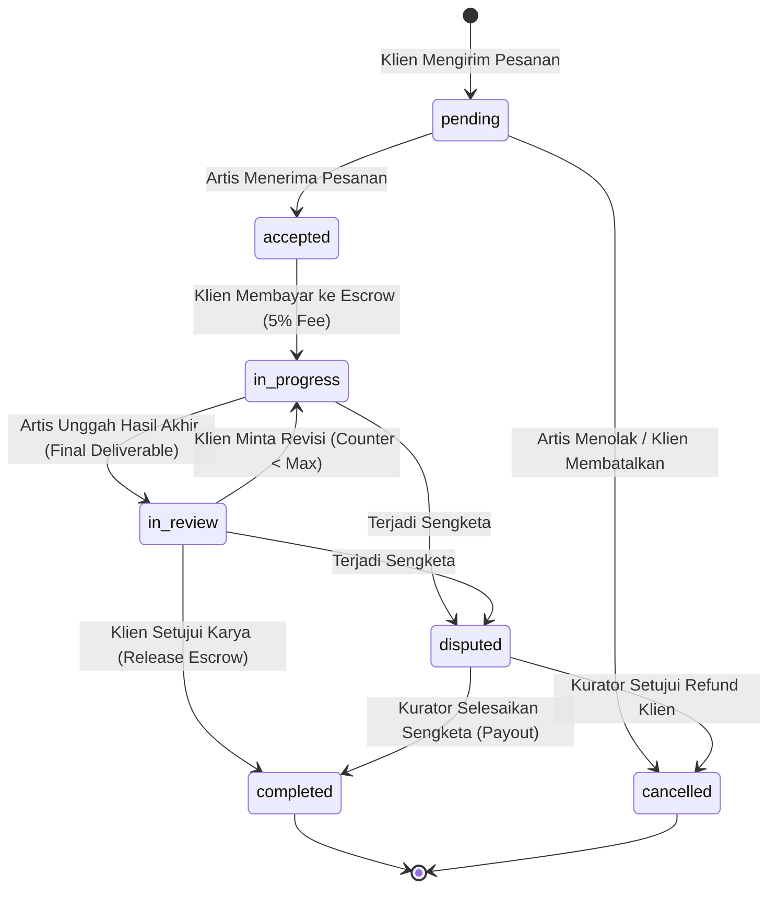

# 📐 Dokumentasi Rumus, Kalkulasi & Logika Bisnis Backend (TruBrush)

Dokumen ini merupakan panduan referensi teknis resmi mengenai **seluruh formula matematika, aturan kalkulasi, mesin status (*state machines*), transaksi database atomik, dan logika bisnis inti** yang diimplementasikan pada Backend NestJS platform **TruBrush**.

---

## 📑 Daftar Isi
1. [Kalkulasi Finansial, Biaya Platform & Aliran Dana Escrow](#1-kalkulasi-finansial-biaya-platform--aliran-dana-escrow)
2. [Formula Kinerja Kurator & Metrik SLA Moderasi Anti-AI](#2-formula-kinerja-kurator--metrik-sla-moderasi-anti-ai)
3. [Sistem Penalti Strike, Pemblokiran Akun & Pemulihan Banding](#3-sistem-penalti-strike-pemblokiran-akun--pemulihan-banding)
4. [Mesin Status (*State Machine*) Pesanan Komisi](#4-mesin-status-state-machine-pesanan-komisi)
5. [Logika Kurasi Karya Seni & Kendali Visibilitas Feed](#5-logika-kurasi-karya-seni--kendali-visibilitas-feed)
6. [Normalisasi Master Tag & Integritas Relasi Database](#6-normalisasi-master-tag--integritas-relasi-database)
7. [Keamanan Otentikasi, Rotasi Token JWT & RBAC](#7-keamanan-otentikasi-rotasi-token-jwt--rbac)

---

## 💰 1. Kalkulasi Finansial, Biaya Platform & Aliran Dana Escrow

### 1.1 Struktur Biaya Komisi (*Platform Fee 5%*)
Platform TruBrush menerapkan biaya administrasi sebesar **5%** yang ditanggung oleh pihak Klien saat melakukan pembayaran komisi ke sistem *escrow*:

$$\text{Platform Fee} = \text{Harga Dasar Komisi } (P_{\text{base}}) \times 5\% = 0.05 \times P_{\text{base}}$$

$$\text{Total Tagihan Klien } (P_{\text{total}}) = P_{\text{base}} + \text{Platform Fee} = 1.05 \times P_{\text{base}}$$

$$\text{Pendapatan Bersih Artis} = P_{\text{base}} \quad (\text{Artis menerima 100\% dari harga yang dipatok})$$

#### Contoh Numerik:
- Harga dasar komisi yang dipatok seniman: **Rp 1.000.000**
- Biaya platform (5%): **Rp 50.000**
- Total saldo klien yang dipotong ke Escrow: **Rp 1.050.000**
- Saat pesanan selesai disetujui klien:
  - Saldo dompet seniman bertambah: **Rp 1.000.000**
  - Pendapatan platform TruBrush (*Platform Revenue*): **Rp 50.000**

---

### 1.2 Transaksi Dompet Atomik (`$transaction` Isolation)
Untuk mencegah *race condition* atau saldo ganda, seluruh mutasi dompet diisolasi dalam transaksi database Prisma:

```mermaid
graph TD
    ClientWallet[Dompet Klien] -->|1. Bayar Komisi (Escrow Lock)| EscrowVault[(Escrow Vault)]
    EscrowVault -->|2a. Komisi Selesai (Release)| ArtistWallet[Dompet Artis]
    EscrowVault -->|2a. Platform Fee 5%| PlatformRevenue[Kas Platform]
    EscrowVault -->|2b. Dispute Refund (Klaim Klien)| ClientWallet
```

#### Aturan Transaksi Dompet:
1. **Top Up Saldo:**
   $$\text{Balance}_{\text{baru}} = \text{Balance}_{\text{lama}} + \text{Amount}$$
2. **Kunci Dana Komisi (*Escrow Lock*):**
   - *Validasi:* $\text{Balance}_{\text{klien}} \ge P_{\text{total}}$ (jika kurang, lempar `BadRequestException`).
   - $\text{Balance}_{\text{klien}} = \text{Balance}_{\text{klien}} - P_{\text{total}}$.
   - Status komisi berubah menjadi `in_progress`.
3. **Pencairan Dana (*Release Escrow*):**
   - $\text{Balance}_{\text{artis}} = \text{Balance}_{\text{artis}} + P_{\text{base}}$.
   - Buat log transaksi bertipe `commission_payout` untuk seniman dan `platform_fee` untuk pembukuan platform.
4. **Pengembalian Dana Sengketa (*Dispute Refund*):**
   - Jika sengketa dimenangkan klien, dana dikembalikan penuh 100%:
     $$\text{Balance}_{\text{klien}} = \text{Balance}_{\text{klien}} + P_{\text{total}}$$
5. **Penarikan Dana Artis (*Withdrawal*):**
   - *Validasi:* $\text{Balance}_{\text{artis}} \ge \text{Amount}$.
   - $\text{Balance}_{\text{artis}} = \text{Balance}_{\text{artis}} - \text{Amount}$.

---

### 1.3 Rumus Agregasi Laporan Finansial Global (`TransactionsService`)
- **Total GMV (*Gross Merchandise Value*):**
  $$\text{GMV} = \sum \text{Amount dari seluruh transaksi bertipe } \texttt{commission\_payment}$$
- **Platform Revenue:**
  $$\text{Revenue} = \sum \text{Amount dari seluruh transaksi bertipe } \texttt{platform\_fee}$$
- **Escrow Balance Saat Ini (*In-Hold*):**
  $$\text{Escrow Balance} = \sum \text{Total Tagihan dari pesanan komisi berstatus } \texttt{in\_progress} \text{ atau } \texttt{in\_review}$$
- **Total Payout (Dana yang ditarik seniman):**
  $$\text{Total Payout} = \sum \text{Amount dari transaksi bertipe } \texttt{withdraw}$$

---

## ⏱️ 2. Formula Kinerja Kurator & Metrik SLA Moderasi Anti-AI

Modul **`CuratorPerformanceModule`** menghitung efisiensi kerja tim kurator dalam memverifikasi keaslian karya seni manusia:

### 2.1 Waktu Respons Kurasi (SLA Duration)
Untuk setiap karya yang diperiksa, durasi respons dihitung dalam satuan menit:

$$\text{Duration}_{\text{karya}} = \frac{\text{Timestamp}(\texttt{reviewedAt}) - \text{Timestamp}(\texttt{createdAt})}{1000 \times 60} \quad (\text{menit})$$

$$\text{Rata-rata SLA Kurator} = \frac{\sum_{i=1}^{N} \text{Duration}_i}{N} \quad (N = \text{Total karya yang ditinjau kurator})$$

- **Indikator Kecepatan:**
  - $\le 60 \text{ menit}$: Respons Sangat Cepat (*Badge Hijau*).
  - $> 60 \text{ menit}$: Respons Normal / Perlu Peningkatan.

---

### 2.2 Rasio Kelolosan Kurasi (*Anti-AI Approval Rate*)
$$\text{Approval Rate (\%)} = \left( \frac{\text{Jumlah Karya Disetujui (Approved)}}{\text{Total Karya yang Ditinjau (Reviewed)}} \right) \times 100\%$$

$$\text{Rejection Rate (\%)} = 100\% - \text{Approval Rate (\%)} = \left( \frac{\text{Jumlah Karya Ditolak (Rejected)}}{\text{Total Karya Ditinjau}} \right) \times 100\%$$

---

### 2.3 Total Beban Kerja Moderasi (*Total Actions*)
$$\text{Total Actions} = \text{Artworks Reviewed} + \text{Disputes Resolved} + \text{Reports Resolved}$$

---

## 🚨 3. Sistem Penalti Strike, Pemblokiran Akun & Pemulihan Banding

### 3.1 Pemicu Penalti (+1 Strike)
*Strike count* akun seniman **hanya akan bertambah** jika pelanggaran telah diverifikasi resmi oleh kurator:

1. **Laporan Pelanggaran Disetujui Kurator (`/api/reports/:id/resolve`):**
   - Pelanggaran seperti: Bukti WIP palsu, menggunakan Generative AI, atau plagiarisme hak cipta.
   - Efek: $\text{StrikeCount}_{\text{artist}} = \text{StrikeCount}_{\text{artist}} + 1$.
2. **Dispute Sengketa Dimenangkan Klien (`/api/disputes/:id/resolve`):**
   - Seniman menolak menyelesaikan pesanan atau melanggar kesepakatan komisi.
   - Efek: $\text{StrikeCount}_{\text{artist}} = \text{StrikeCount}_{\text{artist}} + 1$.

> [!NOTE]
> Tindakan **Takedown** karya di katalog oleh Administrator **TIDAK** menambah *strike count* seniman.

---

### 3.2 Aturan Ambang Batas Pemblokiran (*Account Suspension Threshold*)
$$\text{Status Akun} = \begin{cases} 
\textbf{Aktif / Normal}, & \text{jika } \text{StrikeCount} < 5 \\ 
\textbf{Diblokir (Suspended)}, & \text{jika } \text{StrikeCount} \ge 5 
\end{cases}$$

- **Konsekuensi Akun Terblokir:**
  - Dilarang mengunggah karya baru (`POST /api/artwork` dilempar `ForbiddenException`).
  - Dilarang menerima pesanan komisi baru.
  - Ditampilkan banner peringatan pemblokiran pada UI.

---

### 3.3 Alur Banding (*Appeal Workflow*)
1. Seniman mengajukan permohonan pemulihan akun beserta alasan dan bukti pendukung (`POST /api/appeals`).
2. Administrator meninjau pengajuan banding:
   - **Jika Disetujui (`status: 'approved'`):**
     $$\text{StrikeCount} \leftarrow 0 \quad (\text{Akun seniman dipulihkan sepenuhnya})$$
   - **Jika Ditolak (`status: 'rejected'`):**
     $$\text{StrikeCount} \ge 5 \quad (\text{Akun tetap berstatus terblokir})$$

---

## 🔄 4. Mesin Status (*State Machine*) Pesanan Komisi



### Validasi Batas Revisi:
$$\text{Revision Allowed} \iff \text{Current Revisions} < \text{Max Revisions Allowed}$$
Jika batas revisi tercapai, klien hanya memiliki opsi **Menyetujui Karya** atau **Mengajukan Sengketa (*Dispute*)**.

---

## 🎨 5. Logika Kurasi Karya Seni & Kendali Visibilitas Feed

### 5.1 Penentuan Status Unggah Awal
Saat artis memanggil `POST /api/artwork`:
- **`uploadType == 'curated'`:**
  - $\text{curationStatus} = \texttt{'pending'}$
  - $\text{isVisibleOnFeed} = \texttt{false}$
  - Karya masuk ke antrean verifikasi kurator (`/dashboard/review-artworks`).
- **`uploadType == 'direct'` (Tanpa Kurasi):**
  - $\text{curationStatus} = \texttt{'approved'}$
  - $\text{isVisibleOnFeed} = \texttt{true}$
  - Karya langsung tayang di feed publik tanpa lencana verifikasi anti-AI.

---

### 5.2 Keputusan Kurator Anti-AI
- **Disetujui (`approved`):**
  - $\text{curationStatus} = \texttt{'approved'}$
  - $\text{isVisibleOnFeed} = \texttt{true}$
  - $\text{reviewedBy} = \text{Curator ID}$, $\text{reviewedAt} = \text{Timestamp sekarang}$.
- **Ditolak (`rejected`):**
  - $\text{curationStatus} = \texttt{'rejected'}$
  - $\text{isVisibleOnFeed} = \texttt{false}$
  - $\text{rejectionReason} = \text{Alasan penolakan dari kurator}$.

---

### 5.3 Filter Feed Publik
Feed publik (`GET /api/artwork`) hanya mengembalikan karya dengan kondisi:
$$\text{isVisibleOnFeed} == \texttt{true} \quad \land \quad \text{curationStatus} == \texttt{'approved'}$$

---

## 🏷️ 6. Normalisasi Master Tag & Integritas Relasi Database

### 6.1 Normalisasi Tag
Setiap nama tag yang masuk selalu melalui normalisasi string untuk mencegah duplikasi:
$$\text{normalizedTagName} = \text{input}.\text{trim}().\text{toLowerCase}()$$

### 6.2 Penghapusan Tag yang Aman (*Cascade Isolation*)
Ketika tag dihapus oleh Admin (`DELETE /api/artworks/tags/:id`):
1. Sistem menghapus baris relasi di tabel penghubung `artwork_tags` di dalam transaksi `$transaction`.
2. Sistem menghapus entitas `tag` dari tabel `tags`.
3. **Karya seni (*Artwork*) tetap 100% aman dan tidak terhapus**, hanya asosiasi tag pada karya tersebut yang terlepas (*detached*).

---

## 🔐 7. Keamanan Otentikasi, Rotasi Token JWT & RBAC

1. **Password Hashing:**
   - Algoritma: `bcrypt` dengan *salt rounds* = 10.
2. **Masa Berlaku Token:**
   - **Access Token:** 15 Menit (`JWT_ACCESS_EXPIRATION=15m`).
   - **Refresh Token:** 7 Hari (`JWT_REFRESH_EXPIRATION=7d`).
3. **Rotasi Refresh Token:**
   - Setiap kali `POST /api/auth/refresh` dipanggil, refresh token lama divalidasi dan token baru digenerate secara otomatis.
4. **Role-Based Access Control (RBAC):**
   - `@Roles('admin')`: Khusus Super Administrator.
   - `@Roles('curator', 'admin')`: Akses peninjauan kuratorial dan metrik kerja.
   - `@Roles('artist')`: Unggah karya, terima komisi, penarikan dana.
   - `@Roles('client')`: Pesan komisi seni, deposit escrow, ajukan dispute.
